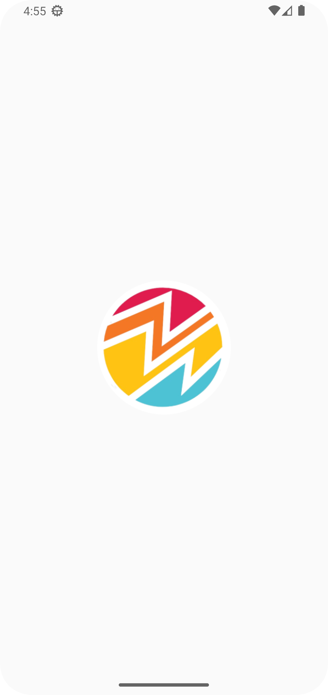
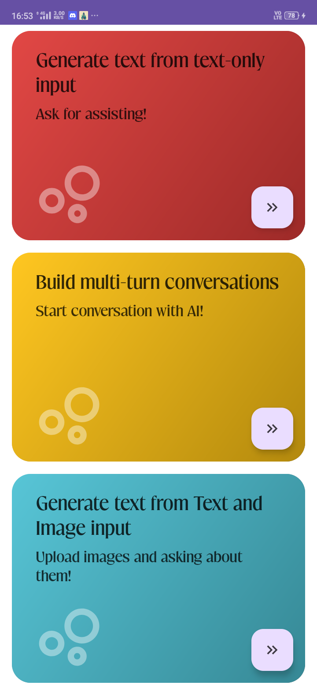
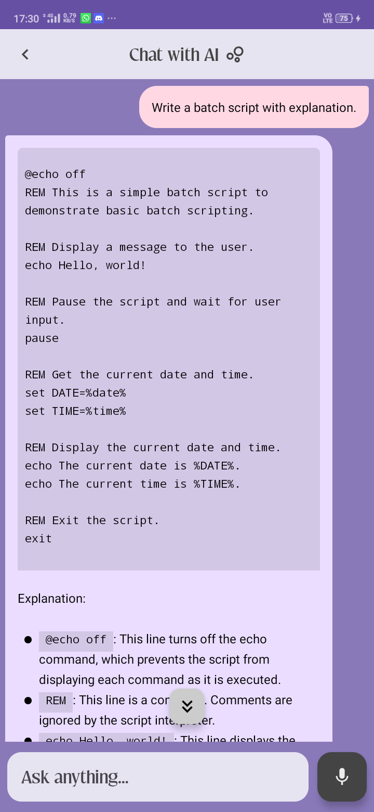

# Insight Craft Android App 

## Overview
Insight Craft is an intuitive Android application that leverages Google's cutting-edge *Gemini Pro AI* model to provide users with advanced features for text input search, AI-powered chat interaction, and photo reasoning capabilities.

## Snapshots📸

| Splash screen             | Home screen               | Summarize with AI         |
|---------------------------|---------------------------|---------------------------|
|     |       |  |
| Chat with AI              | Photo Reasoning           |
|       |  |

## Features
- **Text Input Search:** Insight Craft allows users to input text for summarizing phrases and blogs using the powerful capabilities of the Gemini Pro AI model. This feature enables users to obtain concise and meaningful summaries of written content efficiently.
- **AI Chat Screen:** The application offers a chat screen that enables users to engage in conversation with an AI-powered chatbot, powered by *Google's Gemini Pro AI* model. This allows for interactive and informative exchanges with the AI to address queries and provide assistance.
- **Photo Reasoning Model:** Insight Craft incorporates a photo reasoning model that enables users to upload multiple images and ask questions based on the visual content. Leveraging the capabilities of the *Gemini Pro AI* model, users can receive insightful responses related to the images they upload.

## Integration with Gemini Pro AI Model
Insight Craft is integrated with Google's *Gemini Pro AI* model, which enables it to offer high-performance and advanced AI capabilities to its users. By utilizing the Gemini Pro model, the application ensures exceptional accuracy and efficiency in text summarization, chat interactions, and photo reasoning functionalities.

## Usage
Users can simply download the Insight Craft app from release and experience the seamless integration of *Gemini Pro AI* capabilities to enhance their text search, chat interactions, and photo reasoning experiences.

## How to Contribute
Contributing is easy, and all skill levels are welcome! Here's how you can get started:
1. **Fork this repository:** Click the "Fork" button in the upper right-hand corner of this page to create your copy of the repository.
2. **Clone your fork:** Use Git to clone your forked repository to your local machine:
3. **Make your contributions:** Work on any open issue or feature you find interesting, or create your own! Be sure to follow our coding guidelines.
4. **Push your changes:** Once you're ready, push your changes to your forked repository.
5. **Create a Pull Request:** Submit a Pull Request (PR) to our repository from your fork. Our team will review your changes and provide feedback if necessary.
6. **Celebrate!** 🎉 You've made a contribution to open source!

## Feedback
I welcome all user feedback and suggestions to continuously improve the app and optimize the utilization of the Gemini Pro AI model for an enhanced user experience.

Enjoy using Insight Craft and explore the transformative potential of Google's *Gemini Pro AI* model on your Android device!
